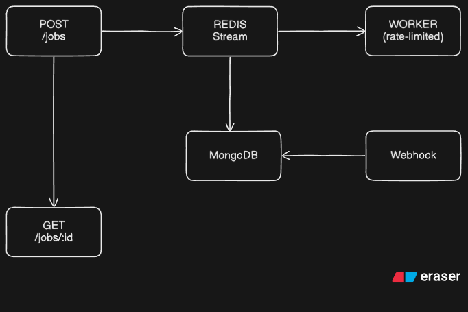

# EnrichLabs

## Clone and Build

```bash
git clone https://github.com/chirag416/enrichLabs.git
cd enrichLabs
docker-compose up --build
```

## Architecture Diagram



## API Endpoints

### Submit Job

**POST:** `/jobs`

**Content-Type:** `application/json`

**Body:**
```json
{
  "name": "John Doe",
  "vendor": "sync"
  // or "async"
}
```

**Response:**
```json
{
  "request_id": "e7f2d8d0-42f7-4e59-83f2-2193b8f1a738"
}
```

### Check Job Status

**GET:** `/jobs/{request_id}`

**Response:**
```json
{
  "status": "processing"
}
```

OR

```json
{
  "status": "complete",
  "result": {
    "name": "Chirag",
    "info": "Processed sync"
  }
}
```

## Components

| Component      | Description                                                                |
| -------------- | -------------------------------------------------------------------------- |
| API Server     | Accepts job requests, pushes to Redis Streams, responds with UUID          |
| Worker         | Background processor, pulls from Redis, applies rate-limiting, saves to DB |
| Vendor Mocks   | Simulated `sync` and `async` vendor endpoints                              |
| Webhook Server | Handles async callbacks and completes jobs                                 |
| MongoDB        | Stores job metadata and final results                                      |
| Redis Streams  | Acts as the job queue                                                      |

## Load Testing

Used k6 with 200 concurrent users for 60 seconds (mixed GET and POST). Script: `loadtest/script.js`

### Result

```
          /\      Grafana   /‾‾/  
     /\  /  \     |\  __   /  /  
    /  \/    \    | |/ /  /   ‾‾\  
   /          \   |   (  |  (‾)  | 
  / __________ \  |_|\_\  \_____/ 
                                 
  execution: local
     script: loadtest.js
     output: -

  scenarios: (100.00%) 1 scenario, 200 max VUs, 1m30s max duration (incl. graceful stop):
           * default: 200 looping VUs for 1m0s (gracefulStop: 30s)

█ TOTAL RESULTS

  checks_total.......................: 3744    58.343273/s
  checks_succeeded...................: 100.00% 3744 out of 3744
  checks_failed......................: 0.00%   0 out of 3744

  ✓ POST successful
  ✓ GET response valid

HTTP
  http_req_duration.......................................................: avg=3.23s min=490.84ms med=2.93s max=9.85s p(90)=7.53s p(95)=8.62s
    { expected_response:true }............................................: avg=1.24s min=490.84ms med=1s    max=3.41s p(90)=2.11s p(95)=2.58s
  http_req_failed.........................................................: 48.93% 1832 out of 3744
  http_reqs...............................................................: 3744   58.343273/s

EXECUTION
  iteration_duration......................................................: avg=3.33s min=592.19ms med=3.04s max=9.95s p(90)=7.64s p(95)=8.73s
  iterations..............................................................: 3744   58.343273/s
  vus.....................................................................: 19     min=19           max=200
  vus_max.................................................................: 200    min=200          max=200

NETWORK
  data_received...........................................................: 1.0 MB 16 kB/s
  data_sent...............................................................: 470 kB 7.3 kB/s

running (1m04.2s), 000/200 VUs, 3744 complete and 0 interrupted iterations
                                                                    
default ✓ [======================================] 200 VUs  1m0s
```

### Result Analysis

- **Total Requests:** 3744
- **Successful:** 100% checks passed
- **HTTP Failures:** 48.93% (expected due to async jobs not completing in time)
- **Average Req Time:** 3.23s
- **Max Req Time:** 9.85s
- **P(90):** 7.53s
- **P(95):** 8.62s
